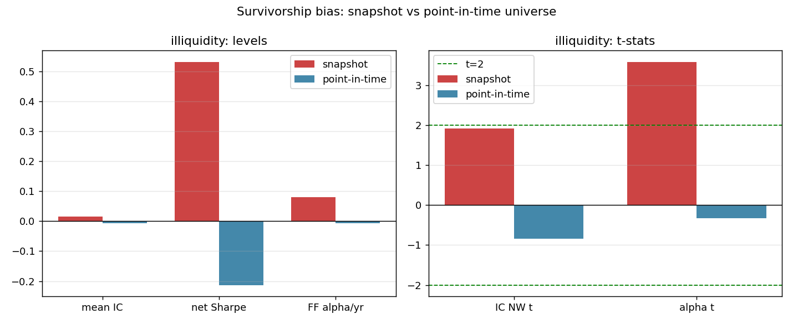
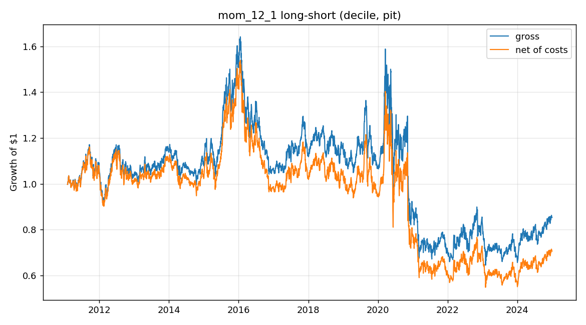
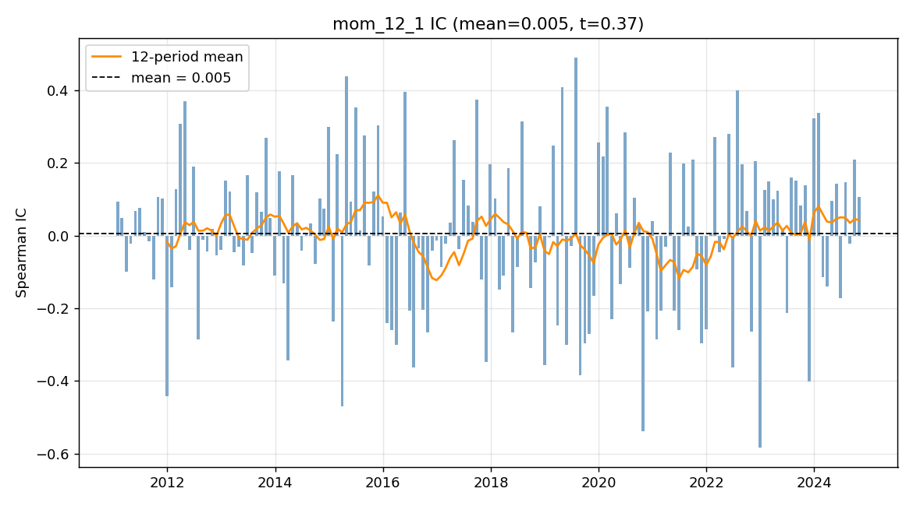

# Cross-Sectional Equity Signals Under Point-in-Time Membership

## Key takeaways

- Across six well-documented price/volume signals on a **point-in-time** S&P 500
  universe (2010–2024, monthly rebalance, 10 bps/side costs), **no signal
  survives**: the best-by-net-Sharpe signal (12–1 momentum) has mean IC ≈ 0.005
  (Newey–West t ≈ 0.4), net Sharpe ≈ 0.01, and a **deflated Sharpe of 0.35**
  (< 0.5) after correcting for the 12 configurations tried.
- The headline result of the project is a **methodological one**: a prior
  "illiquidity alpha" of **+8.0%/yr (t ≈ 3.6)** measured on today's S&P 500
  snapshot was almost entirely a **survivorship artifact** — it collapses to
  **−0.7%/yr (t ≈ −0.3)** once the universe is made point-in-time.
- Simply holding the equal-weight market (excess Sharpe ≈ +0.86) beat every
  long–short signal net of costs.
- A LinUCB contextual-bandit allocator does **not** rescue the result: all signal
  combinations (learned, equal-weight, mean–variance) have **negative**
  out-of-sample net Sharpe. There is no profitable combination to find.

Every number here is reproducible from a command (see §7) and is independently
re-derived by `experiments/verify_headline.py`.

## 1. Question and motivation

Do simple, well-known cross-sectional equity signals predict returns **net of
transaction costs**, once evaluated with honest statistics? The interesting
deliverable for a quant-research reviewer is not a high Sharpe — it is the
discipline: controlling look-ahead bias, modelling costs, correcting for
multiple testing, and — the focus of this revision — controlling **survivorship
bias**. The original version of this study (a current S&P 500 snapshot) already
suspected that its single positive result, an illiquidity tilt, was a
survivorship artifact. This report tests that suspicion directly.

## 2. Data

**Universe (point-in-time).** The tradable set at each rebalance date `t` is the
S&P 500 constituents **as of `t`**, including names later removed (delisted,
acquired, demoted). Membership intervals come from the free `fja05680/sp500`
historical-constituents list (`src/universe_pit.py`, `members_asof(t)`). The
union of all ever-members over 2010–2024 is 805 tickers.

**Survivorship handling and the residual-bias note.** Of those 805 ever-members,
**614 have usable Yahoo Finance prices**; **191 are missing/unrecoverable**
(delisted/renamed beyond our symbol remaps, or so corrupted that a data-quality
filter dropped them). Because missing names skew toward failures and
acquisitions, a *residual* survivorship bias remains, and delisting returns are
not modelled (a removed name simply stops contributing). The point-in-time
numbers should therefore be read as an **upper bound** on signal strength, not a
bias-free truth. A data-quality filter (`clean_prices`) removes tickers with a
maximum |daily return| above 200% or a minimum adjusted close below $0.05 — loose
enough to keep legitimate moves such as GameStop's real +135% squeeze day, strict
enough to drop corrupted series (e.g. one ticker showed an 8000× one-day jump).

**Prices.** Daily adjusted OHLCV via `yfinance` (`auto_adjust=True`).
**Factors.** Fama–French 5 factors + momentum + risk-free from the Ken French
Data Library (direct CSV).

## 3. Signals

Six signals, all strictly point-in-time (backward-looking windows only) and
oriented *long-high* using the academic prior fixed **before** looking at the
data (so the sign is not fit to the sample): 12–1 momentum, 1-month reversal,
low realized volatility, low idiosyncratic volatility (residual vs the market),
52-week-high proximity, and an illiquidity proxy (negative log average dollar
volume). Each is cross-sectionally z-scored within each date, computed **only
among the as-of-date index members** so the standardization never uses a
future-membership cross-section.

## 4. Methodology

**Point-in-time discipline.** Features at `t` use only data ≤ `t`; the target is
the *forward* 21-day return. The backtest applies weights with a one-day lag, so
a weight set at `t` cannot capture `t`'s own return (asserted in tests). A
membership mask ensures the portfolio holds only as-of-date members.

**Portfolio & costs.** Monthly rebalance; dollar-neutral long top decile / short
bottom decile (and a rank-weighted variant). Transaction costs = `bps/side ×
turnover`, charged on the rebalance date; results reported gross **and net**.

**Cross-validation.** Purged + embargoed walk-forward / k-fold splits
(López de Prado): tests assert no training index falls within `horizon + embargo`
of any test index.

**Evaluation.** Spearman IC per period with **Newey–West (HAC) t-stats**;
annualized return/vol/Sharpe, max drawdown, turnover; a **Deflated Sharpe Ratio**
that corrects for the number of configurations tried; **factor-neutral alpha**
from regressing the long–short return on FF5 + momentum (HAC errors). Baselines:
equal-weight market, a no-skill random signal, and each single signal.

## 5. Results

**Headline (point-in-time).** Selected signal 12–1 momentum (decile): mean IC
+0.0052 (NW t = +0.37), gross Sharpe +0.07, **net Sharpe +0.01**, **deflated
Sharpe 0.35**, FF5+momentum alpha −3.3%/yr (t = −1.21). Every one of the six
signals has a net Sharpe of approximately zero or negative
(`results/signal_summary.csv`). The no-skill random signal scores −0.70 and the
equal-weight market +0.86 — i.e. the market beat the signals.

**The survivorship before/after — the centerpiece.** Holding methodology fixed
and changing only the universe (snapshot → point-in-time), the previously "best"
signal, illiquidity, decomposes as follows
(`results/survivorship_comparison.csv`, `results/survivorship_comparison.png`):

| illiquidity signal      | Snapshot (biased) | Point-in-time | Δ        |
|-------------------------|-------------------|---------------|----------|
| Mean IC                 | +0.0153           | −0.0060       | −0.0213  |
| IC Newey–West t         | +1.92             | −0.84         | −2.77    |
| Long–short Sharpe (net) | +0.53             | −0.21         | −0.74    |
| FF5+momentum alpha      | +8.0%/yr          | −0.7%/yr      | −8.7 pp  |
| alpha t-stat            | +3.59             | −0.33         | −3.92    |

The snapshot universe also manufactured a strong pre-2020 illiquidity Sharpe of
+1.27; point-in-time, the selected signal's pre-2020 Sharpe is +0.05. The
"edge" was the bias.

**Regime dependence.** Even the point-in-time selected signal is weak in both
sub-periods (net Sharpe ≈ +0.05 pre-2020, ≈ −0.07 post-2020), so there is no
hidden regime in which a signal works.

**RL allocator.** Framed as a contextual bandit (state = market-regime features
+ lagged realized per-signal returns; action = which signal to tilt toward;
reward = next-period net return), trained online walk-forward with the same
no-leakage discipline. Out-of-sample net Sharpe: learned LinUCB −0.05,
equal-weight −0.23, mean–variance −0.56 (`results/rl_allocator_summary.csv`). The
learned allocator is the least-negative, but **all three lose money** — a
negative Sharpe is not a win.







## 6. Conclusion

On a point-in-time S&P 500 universe, with transaction costs, multiple-testing
correction, and survivorship control, **no simple cross-sectional price/volume
signal earns a statistically credible net return** over 2010–2024. The single
result that looked promising on a naïve current-constituent universe — an
illiquidity alpha of +8%/yr at t ≈ 3.6 — was a survivorship artifact that
disappears (and slightly reverses) once membership is made point-in-time. No
learned or classical combination of the signals is profitable out of sample.
This is the honest answer to the motivating question, and it is the kind of
null result that the discipline is designed to surface rather than hide.

## 7. Limitations and reproduce

**Limitations** (full list in `LIMITATIONS.md`): residual survivorship via the
191/805 price-coverage gap; delisting returns not modelled; simplified cost model
(no spread term-structure, market impact, or borrow fees); idiosyncratic
volatility from a single-factor model; illiquidity is a dollar-volume proxy (no
point-in-time shares outstanding); Yahoo adjusted prices are restated over time;
short IC sample (~170 months).

**Reproduce:**

```bash
pip install -r requirements.txt
python -m experiments.run_baseline --universe pit        # headline (point-in-time)
python -m experiments.run_baseline --universe snapshot   # old survivorship-biased run
python -m experiments.run_comparison                     # snapshot vs PIT before/after
python -m experiments.run_rl --universe pit --learner linucb
python -m experiments.verify_headline --universe pit     # independent re-derivation
pytest -q                                                # rigor tests
```
